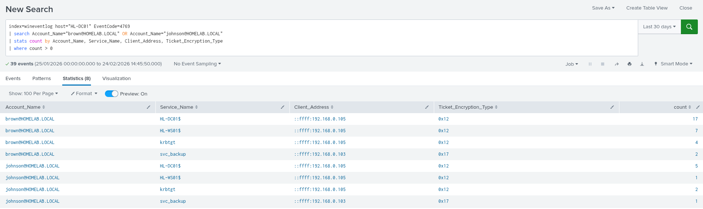
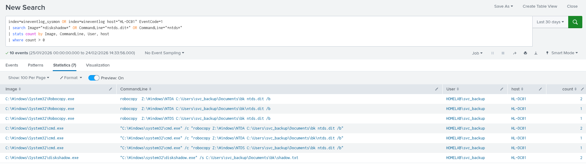
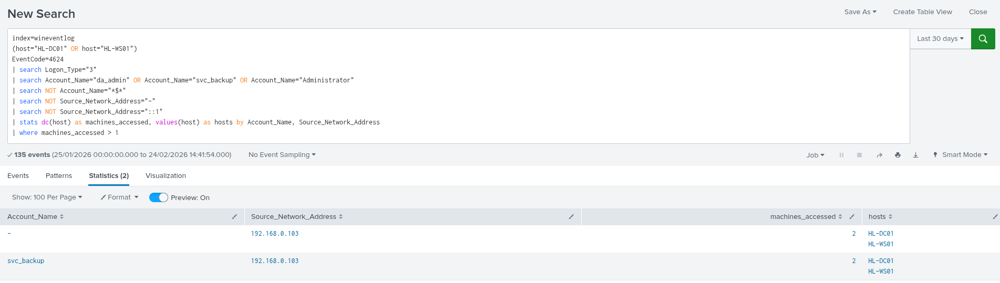

# Splunk Alert Rules

> **Platform:** Splunk Enterprise  
> **Indexes:** wineventlog, wineventlog_sysmon  
> **Total Alerts:** 4  
> **Author:** Karishan

---

## How to Configure Alerts in Splunk
```
1. Run the query in Splunk Search
2. Click "Save As" → Alert
3. Fill in Title, Schedule, and Trigger conditions
4. Click Save
5. Verify under Activity → Triggered Alerts
```

---

## Alert 1 — Kerberoasting Detected

**Severity:** High  
**ATT&CK:** T1558.003  
**Description:** Detects RC4 encrypted TGS ticket requests from non-machine 
accounts — the primary indicator of a Kerberoasting attack.

### Query
```
index=wineventlog host="HL-DC01" EventCode=4769
| search Account_Name="brown@HOMELAB.LOCAL" OR Account_Name="johnson@HOMELAB.LOCAL"
| stats count by Account_Name, Service_Name, Client_Address, Ticket_Encryption_Type
| where count > 0
```

### Splunk Alert Settings
```
Title:        ALERT — Kerberoasting Detected
Alert Type:   Scheduled
Schedule:     Run every hour
Trigger:      Number of results greater than 0
Severity:     High
Action:       Add to Triggered Alerts
```

### Why This Fires
```
Any domain user requesting RC4 encrypted TGS tickets is suspicious.
RC4 (0x17) is weaker than AES and specifically requested by attackers
to make offline cracking faster. Legitimate services use AES by default.
```

### Response Steps
```
1. Identify the source IP in Client_Address field
2. Check if the account is compromised
3. Review all TGS requests from that account in last 24 hours
4. Reset the targeted service account password immediately
5. Consider enforcing AES-only Kerberos encryption
```


---

## Alert 2 — LSASS Memory Access Detected

**Severity:** Critical  
**ATT&CK:** T1003.001  
**Description:** Detects suspicious process access to LSASS memory — 
the primary method used by credential dumping tools like Mimikatz 
and secretsdump.

### Query
```
index=wineventlog_sysmon
(host="HL-DC01" OR host="HL-WS01")
EventCode=10
| search TargetImage="*lsass*"
| search NOT SourceImage IN (
    "C:\\Windows\\System32\\svchost.exe",
    "C:\\Windows\\System32\\wininit.exe",
    "C:\\Windows\\System32\\csrss.exe",
    "C:\\Windows\\Sysmon64.exe",
    "C:\\Windows\\System32\\lsass.exe",
    "C:\\Windows\\System32\\services.exe",
    "C:\\Program Files\\Windows Defender\\MsMpEng.exe")
| stats count by SourceImage, TargetImage, GrantedAccess, user, host
| where count > 0
```

### Splunk Alert Settings
```
Title:        ALERT — LSASS Memory Access Detected
Alert Type:   Real Time
Trigger:      Per Result — fires immediately on each event
Severity:     Critical
Action:       Add to Triggered Alerts
```

### Why This Fires
```
Any process opening a handle to LSASS with suspicious access rights
is a strong indicator of credential dumping. Legitimate processes
rarely need to access LSASS memory directly.

Suspicious GrantedAccess values:
0x1010  → Read process memory
0x1410  → Read + query information
0x143a  → Full credential dump access
```

### Response Steps
```
1. Identify SourceImage — what process accessed LSASS
2. Check if process is legitimate (AV, EDR tools may trigger)
3. Isolate the machine immediately if unknown process
4. Review all logon events on that machine in last hour
5. Check for lateral movement from that machine
```

> **Lab Note:** This alert did not fire during this engagement because 
> secretsdump was run before Sysmon was fully configured and logging to 
> Splunk. In a production environment this alert would catch tools like 
> Mimikatz, secretsdump, and pypykatz accessing LSASS in real time.
> 
> To test this alert re-run secretsdump against HL-WS01 with Sysmon 
> running and verify EID 10 appears in wineventlog_sysmon.

---

## Alert 3 — NTDS Dump Attempt Detected

**Severity:** Critical  
**ATT&CK:** T1003.003  
**Description:** Detects diskshadow execution or direct NTDS.dit access 
on a Domain Controller — almost always indicates an NTDS dump attempt.

### Query
```
index=wineventlog_sysmon host="HL-DC01" EventCode=1
| search Image="*diskshadow*" OR CommandLine="*ntds.dit*" OR CommandLine="*ntds*"
| stats count by Image, CommandLine, User, host
| where count > 0
```

### Splunk Alert Settings
```
Title:        ALERT — NTDS Dump Attempt on DC
Alert Type:   Real Time
Trigger:      Per Result — fires immediately on each event
Severity:     Critical
Action:       Add to Triggered Alerts
```

### Why This Fires
```
diskshadow.exe has very few legitimate use cases on a Domain Controller.
Its presence combined with NTDS references is an almost certain indicator
of an attacker attempting to extract the Active Directory database.
```

### Response Steps
```
1. Immediately isolate HL-DC01 from the network
2. Identify the user account running diskshadow
3. Check for recently created shadow copies
4. Review all authentication events in last 2 hours
5. Check if NTDS.dit and SYSTEM.hive were copied anywhere
6. Initiate full incident response procedure
```



---

## Alert 4 — Pass-the-Hash Pattern Detected

**Severity:** High  
**ATT&CK:** T1550.002  
**Description:** Detects the Pass-the-Hash pattern — same privileged 
account logging into multiple machines from the same IP using network 
logons in a short time window.

### Query
```
index=wineventlog
(host="HL-DC01" OR host="HL-WS01")
EventCode=4624
| search Logon_Type="3"
| search Account_Name="da_admin" OR Account_Name="svc_backup" OR Account_Name="Administrator"
| search NOT Account_Name="*$*"
| search NOT Source_Network_Address="-"
| search NOT Source_Network_Address="::1"
| stats dc(host) as machines_accessed, values(host) as hosts by Account_Name, Source_Network_Address
| where machines_accessed > 1
```

### Splunk Alert Settings
```
Title:        ALERT — Pass-the-Hash Pattern Detected
Alert Type:   Scheduled
Schedule:     Run every 15 minutes
Trigger:      Number of results greater than 0
Severity:     High
Action:       Add to Triggered Alerts
```

### Why This Fires
```
A privileged account authenticating to multiple machines from the
same non-domain IP in a short window is a strong PTH indicator.
Legitimate admin activity typically originates from known admin 
workstations not from attacker IPs like 192.168.0.103.
```

### Response Steps
```
1. Identify Source_Network_Address — is it a known admin machine?
2. Contact the account owner to verify if activity is legitimate
3. If unknown source — disable the account immediately
4. Review all machines accessed and check for persistence
5. Reset the compromised account password
6. Check for Golden Ticket — PTH often precedes ticket forging
```


---

## Alert Summary

| Alert | Severity | Type | ATT&CK | Trigger |
|-------|----------|------|--------|---------|
| Kerberoasting Detected | High | Scheduled — hourly | T1558.003 | Results > 0 |
| LSASS Memory Access | Critical | Real Time | T1003.001 | Per Result |
| NTDS Dump Attempt | Critical | Real Time | T1003.003 | Per Result |
| Pass-the-Hash Pattern | High | Scheduled — 15 min | T1550.002 | Results > 0 |

---

## Alert Tuning Notes
```
Alert 1 — Kerberoasting:
  False positives: Low — RC4 requests from user accounts are rare
  Tune by:        Add whitelist for known legacy service accounts

Alert 2 — LSASS Access:
  False positives: Medium — AV and EDR tools access LSASS legitimately
  Tune by:        Whitelist known security tool processes in SourceImage

Alert 3 — NTDS Dump:
  False positives: Very Low — diskshadow on DC is almost never legitimate
  Tune by:        No tuning needed — treat every hit as critical

Alert 4 — Pass-the-Hash:
  False positives: Medium — jump servers may trigger this
  Tune by:        Add known jump server IPs to exclusion list
```
