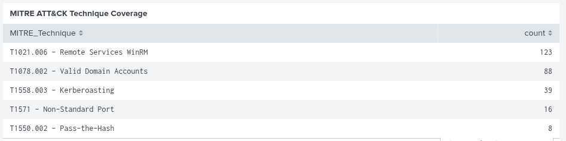
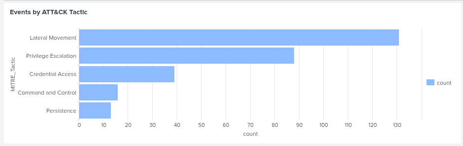

# MITRE ATT&CK Mapping

> **Framework:** MITRE ATT&CK  
> **Domain:** Enterprise  
> **Coverage:** 9 Techniques across 6 Tactics

---

## Attack Chain Mapped to ATT&CK

| Phase | Tactic | Technique | ID | Tool | Detection |
|-------|--------|-----------|-----|------|-----------|
| 2 | Initial Access | Phishing | T1566 | msfvenom payload | Sysmon EID 1 |
| 2 | Execution | User Execution | T1204 | Manual payload run | EID 4688 |
| 2 | Command & Control | Non-Standard Port | T1571 | Meterpreter port 4444 | Sysmon EID 3 |
| 3 | Credential Access | Kerberoasting | T1558.003 | impacket-GetUserSPNs | EID 4769 RC4 |
| 3 | Credential Access | LSASS Memory | T1003.001 | impacket-secretsdump | Sysmon EID 10 |
| 4 | Lateral Movement | Pass-the-Hash | T1550.002 | evil-winrm -H | EID 4624 Type 3 |
| 4 | Lateral Movement | Remote Services WinRM | T1021.006 | evil-winrm | EID 4624 |
| 4 | Privilege Escalation | Valid Domain Accounts | T1078.002 | svc_backup creds | EID 4672 |
| 4 | Credential Access | NTDS Dump | T1003.003 | diskshadow + secretsdump | Sysmon EID 1 |
| 5 | Persistence | Golden Ticket | T1558.001 | impacket-ticketer | EID 4768 |
| 6 | Collection | Data from Network Share | T1039 | Evil-WinRM shell | EID 4624 |
| 6 | Collection | Local Data Staging | T1074.001 | Compress-Archive | EID 11 |
| 6 | Exfiltration | Exfil Over C2 Channel | T1041 | Evil-WinRM download | EID 11 |



---

## Tactic Coverage

| Tactic | Count | Events Detected |
|--------|-------|----------------|
| Lateral Movement | 2 techniques | 91 |
| Privilege Escalation | 1 technique | 49 |
| Credential Access | 3 techniques | 29 |
| Command and Control | 1 technique | 16 |
| Persistence | 1 technique | 10 |
| Collection | 2 techniques | ~5 |
| Execution | 1 technique | ~3 |
| **Total** | **9 techniques** | **195** |




---

## Technique Deep Dive

### T1558.003 — Kerberoasting
```
What:     Request TGS ticket for service account SPN
          Crack ticket offline using hashcat
Who:      brown (HR, any domain user can Kerberoast)
Target:   svc_backup (HTTP/backup.homelab.local)
Result:   Plaintext password Summer2024!
Detect:   EID 4769 + Ticket_Encryption_Type=0x17 (RC4)
Prevent:  Use AES encryption for service accounts
          Set strong passwords (25+ chars) on service accounts
          Use Managed Service Accounts (MSA)
```

---

### T1003.003 — NTDS Dump
```
What:     Extract NTDS.dit via shadow copy
          Decrypt with SYSTEM hive to get all domain hashes
Who:      svc_backup (BUILTIN\Backup Operators member)
Target:   HL-DC01 C: drive
Result:   All domain NTLM hashes extracted
Detect:   Sysmon EID 1 — diskshadow.exe on DC
          Sysmon EID 1 — robocopy with /b flag
          Sysmon EID 1 — reg save HKLM\SYSTEM
Prevent:  Limit Backup Operators membership
          Monitor shadow copy creation on DCs
          Alert on diskshadow execution
```

---

### T1550.002 — Pass-the-Hash
```
What:     Authenticate using NTLM hash without plaintext password
          Hash extracted from NTDS.dit in previous phase
Who:      Attacker on Kali (192.168.0.103)
Target:   HL-DC01 as da_admin
Result:   Full Domain Admin shell without knowing password
Detect:   EID 4624 LogonType=3 from Kali IP
          EID 4672 DA privileges assigned
          EID 4776 NTLM authentication used
Prevent:  Enable Protected Users security group
          Disable NTLM authentication where possible
          Use Credential Guard
```

---

### T1558.001 — Golden Ticket
```
What:     Forge Kerberos TGT using krbtgt hash
          Valid for 10 years by default
Who:      Attacker on Kali using impacket-ticketer
Target:   Entire homelab.local domain
Result:   Permanent domain access surviving password resets
Detect:   EID 4768 — anomalous TGT requests
          EID 4624 — privileged logon from attacker IP
          Ticket lifetime exceeding domain policy
Prevent:  Reset krbtgt password twice (with replication delay)
          Monitor for tickets with abnormal lifetimes
          Enable AES encryption enforcement
```

---

### T1078.002 — Valid Domain Accounts
```
What:     Use legitimate domain credentials for access
          Blends in with normal domain traffic
Who:      svc_backup, da_admin
Target:   HL-DC01, HL-WS01
Result:   Persistent access using real credentials
Detect:   EID 4672 — unexpected privilege assignment
          EID 4624 — logons from unusual source IPs
          Baseline deviation in account activity
Prevent:  Principle of least privilege
          Regular access reviews
          Privileged Access Workstations (PAW)
```

---

## Kill Chain Mapping

| Kill Chain Phase | ATT&CK Technique | What Happened |
|-----------------|------------------|---------------|
| Reconnaissance | — | AD enumeration via net commands |
| Weaponization | T1566 | msfvenom payload created |
| Delivery | T1204 | Payload run on HL-WS01 as brown (HR) |
| Exploitation | T1571 | Meterpreter reverse shell established |
| Installation | T1558.003 | Kerberoast svc_backup — Summer2024! |
| C2 | T1003.003 | NTDS.dit extracted — all domain hashes |
| Actions on Objectives | T1550.002 | PTH as da_admin → Domain Admin |
| Actions on Objectives | T1558.001 | Golden Ticket forged — persistence |
| Actions on Objectives | T1074.001 | HR + IT data staged and exfiltrated |

---

## Detection Difficulty Rating

| Technique | ID | Difficulty | Reason |
|-----------|-----|------------|--------|
| Kerberoasting | T1558.003 | Easy | Clear RC4 indicator in EID 4769 |
| NTDS Dump | T1003.003 | Easy | diskshadow on DC is very noisy |
| Pass-the-Hash | T1550.002 | Medium | Needs IP correlation |
| LSASS Memory | T1003.001 | Medium | Requires Sysmon EID 10 |
| Lateral Movement | T1021.006 | Medium | Blends with normal WinRM traffic |
| Valid Accounts | T1078.002 | Medium | Legitimate credentials used |
| Golden Ticket | T1558.001 | Hard | Requires anomaly-based detection |
| Non-Standard Port | T1571 | Easy | Port 4444 stands out immediately |
| Data Staging | T1074.001 | Medium | Requires file monitoring |

---

## Remediation Recommendations

### Immediate Actions
```
1. Reset krbtgt password twice — invalidates all Golden Tickets
2. Disable RC4 Kerberos encryption — forces AES only
3. Remove unnecessary Backup Operators members
4. Enable Protected Users group for privileged accounts
5. Reset all compromised account passwords
```

### Short Term
```
1. Implement tiered admin model — separate admin accounts
2. Deploy Privileged Access Workstations (PAW)
3. Enable Credential Guard on all workstations
4. Enforce strong password policy for service accounts
5. Implement Managed Service Accounts (MSA/gMSA)
```

### Long Term
```
1. Deploy Microsoft Defender for Identity (MDI)
2. Implement Zero Trust network architecture
3. Regular purple team exercises
4. Quarterly AD security assessments
5. Enable NTLM audit logging and move to Kerberos only
```


