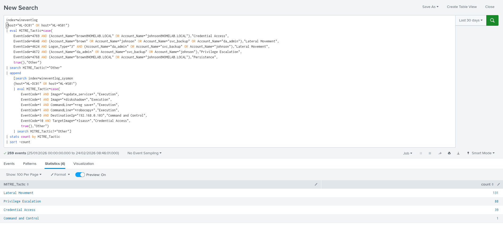

# Splunk Detection Queries

> **SIEM:** Splunk Enterprise  
> **Indexes:** wineventlog, wineventlog_sysmon  
> **Hosts:** HL-DC01 (192.168.0.104), HL-WS01 (192.168.0.105)  
> **Add-ons Required:** Splunk TA for Sysmon, Splunk TA for Windows

---

## Index Reference

| Index | Contents | Source |
|-------|----------|--------|
| wineventlog | Windows Security, System, Application events | Both DC01 + WS01 |
| wineventlog_sysmon | Sysmon process, network, file events | Both DC01 + WS01 |

---

## Phase 2 — Initial Foothold

### Payload Execution — Sysmon EID 1
```
index=wineventlog_sysmon host="HL-WS01" EventCode=1
| search Image="*update_service*"
| table _time, Image, CommandLine, User, ParentImage
```
**What it detects:** Malicious executable launched on victim workstation  
**Confidence:** High  
**ATT&CK:** T1204 — User Execution

---

### Reverse Shell to Kali — Sysmon EID 3
```
index=wineventlog_sysmon host="HL-WS01" EventCode=3
| search DestinationIp="192.168.0.103" DestinationPort=4444
| table _time, Image, DestinationIp, DestinationPort, User
```
**What it detects:** Outbound connection to attacker C2 on non-standard port  
**Confidence:** High  
**ATT&CK:** T1571 — Non-Standard Port

---

### brown (HR) Logon — EID 4624
```
index=wineventlog host="HL-WS01" EventCode=4624
| search Account_Name="brown"
| table _time, Account_Name, Logon_Type, Source_Network_Address
```
**What it detects:** Initial access account logon on workstation  
**Confidence:** Medium  
**ATT&CK:** T1078 — Valid Accounts

---

## Phase 3 — Kerberoasting

### TGS Ticket Request for svc_backup — EID 4769
```
index=wineventlog host="HL-DC01" EventCode=4769
| search Account_Name="brown@HOMELAB.LOCAL" OR Account_Name="johnson@HOMELAB.LOCAL"
| table _time, Account_Name, Service_Name, Client_Address, Ticket_Encryption_Type
```
**What it detects:** Low-privileged user requesting service ticket  
**Confidence:** High  
**ATT&CK:** T1558.003 — Kerberoasting

---

### RC4 Encryption Type — Classic Kerberoast Indicator
```
index=wineventlog host="HL-DC01" EventCode=4769
| search Account_Name="brown@HOMELAB.LOCAL" OR Account_Name="johnson@HOMELAB.LOCAL"
| where Ticket_Encryption_Type="0x17"
| table _time, Account_Name, Service_Name, Client_Address, Ticket_Encryption_Type
```
**What it detects:** RC4 downgrade attack — attacker requested weak encryption for offline cracking  
**Confidence:** High  
**ATT&CK:** T1558.003 — Kerberoasting

---

### SPN Enumeration Pattern
```
index=wineventlog host="HL-DC01" EventCode=4769
| stats count by Account_Name, Service_Name, Client_Address
| sort -count
```
**What it detects:** Bulk SPN enumeration from single source  
**Confidence:** Medium  
**ATT&CK:** T1558.003 — Kerberoasting

---

### johnson (IT) Network Logon to WS01 — EID 4624
```
index=wineventlog host="HL-WS01" EventCode=4624
| search Account_Name="johnson" Logon_Type="3"
| table _time, Account_Name, Logon_Type, Source_Network_Address
```
**What it detects:** IT account lateral movement to workstation  
**Confidence:** Medium  
**ATT&CK:** T1021.006 — Remote Services WinRM

---

### LSASS Memory Access — Sysmon EID 10
```
index=wineventlog_sysmon host="HL-WS01" EventCode=10
| search TargetImage="*lsass*"
| table _time, SourceImage, TargetImage, GrantedAccess, User
```
**What it detects:** Credential dumping tool accessing LSASS process memory  
**Confidence:** High  
**ATT&CK:** T1003.001 — LSASS Memory

---

## Phase 4 — Lateral Movement & Domain Compromise

### svc_backup Logon to DC01 — EID 4624
```
index=wineventlog host="HL-DC01" EventCode=4624
| search Account_Name="svc_backup"
| table _time, Account_Name, Logon_Type, Source_Network_Address
```
**What it detects:** Service account authenticating directly to Domain Controller  
**Confidence:** High  
**ATT&CK:** T1078.002 — Valid Domain Accounts

---

### Diskshadow Execution on DC — Sysmon EID 1
```
index=wineventlog_sysmon host="HL-DC01" EventCode=1
| search Image="*diskshadow*"
| table _time, Image, CommandLine, User, ParentImage
```
**What it detects:** Shadow copy creation for NTDS.dit extraction  
**Confidence:** High — diskshadow on a DC is almost never legitimate  
**ATT&CK:** T1003.003 — NTDS Dump

---

### Robocopy with Backup Flag — Sysmon EID 1
```
index=wineventlog_sysmon host="HL-DC01" EventCode=1
| search CommandLine="*robocopy*" AND CommandLine="*ntds*"
| table _time, Image, CommandLine, User
```
**What it detects:** NTDS.dit being copied from shadow volume  
**Confidence:** High  
**ATT&CK:** T1003.003 — NTDS Dump

---

### SYSTEM Hive Export — Sysmon EID 1
```
index=wineventlog_sysmon host="HL-DC01" EventCode=1
| search CommandLine="*reg save*"
| table _time, Image, CommandLine, User
```
**What it detects:** SYSTEM hive exported — required to decrypt NTDS hashes  
**Confidence:** High  
**ATT&CK:** T1003.003 — NTDS Dump

---

### da_admin Pass-the-Hash — EID 4624 LogonType 3
```
index=wineventlog host="HL-DC01" EventCode=4624
| search Account_Name="da_admin" Logon_Type="3"
| table _time, Account_Name, Logon_Type, Source_Network_Address, Workstation_Name
```
**What it detects:** Domain Admin network logon from Kali IP — PTH pattern  
**Confidence:** High  
**ATT&CK:** T1550.002 — Pass-the-Hash

---

### Special Privileges Assigned — EID 4672
```
index=wineventlog host="HL-DC01" EventCode=4672
| search Subject_Account_Name="da_admin"
| table _time, Subject_Account_Name, Privileges
```
**What it detects:** Domain Admin privileges assigned after PTH logon  
**Confidence:** High  
**ATT&CK:** T1078.002 — Valid Domain Accounts

---

## Phase 5 — Golden Ticket

### TGT Request — EID 4768
```
index=wineventlog host="HL-DC01" EventCode=4768
| search Account_Name="*brown*" OR Account_Name="*johnson*"
| table _time, Account_Name, Client_Address, Ticket_Encryption_Type, Pre_Authentication_Type
```
**What it detects:** Kerberos TGT request from attacker accounts  
**Confidence:** Medium — requires correlation with other events  
**ATT&CK:** T1558.001 — Golden Ticket

---

### Administrator Logon from Kali IP — EID 4624
```
index=wineventlog host="HL-DC01" EventCode=4624
| search Account_Name="Administrator" Source_Network_Address="192.168.0.103"
| table _time, Account_Name, Logon_Type, Source_Network_Address
```
**What it detects:** Built-in Administrator logging in from attacker IP  
**Confidence:** High  
**ATT&CK:** T1558.001 — Golden Ticket

---

## Phase 6 — Data Exfiltration

### Files Staged in Temp — Sysmon EID 11
```
index=wineventlog_sysmon host="HL-DC01" EventCode=11
| search TargetFilename="*exfil*" OR TargetFilename="*data.zip*"
| table _time, Image, TargetFilename, User
```
**What it detects:** Sensitive files staged in Temp directory  
**Confidence:** High  
**ATT&CK:** T1074.001 — Local Data Staging

---

### Compress-Archive on DC — Sysmon EID 1
```
index=wineventlog_sysmon host="HL-DC01" EventCode=1
| search CommandLine="*Compress-Archive*" OR CommandLine="*data.zip*"
| table _time, Image, CommandLine, User
```
**What it detects:** Data being compressed before exfiltration  
**Confidence:** High  
**ATT&CK:** T1074.001 — Local Data Staging

---

## Full Attack Timeline Query
```
index=wineventlog
(host="HL-DC01" OR host="HL-WS01")
| eval MITRE_Tactic=case(
    EventCode=4769 AND (Account_Name="brown@HOMELAB.LOCAL" OR Account_Name="johnson@HOMELAB.LOCAL"),"Credential Access",
    EventCode=4648 AND (Account_Name="brown" OR Account_Name="johnson" OR Account_Name="svc_backup" OR Account_Name="da_admin"),"Lateral Movement",
    EventCode=4624 AND Logon_Type="3" AND (Account_Name="da_admin" OR Account_Name="svc_backup" OR Account_Name="johnson"),"Lateral Movement",
    EventCode=4672 AND (Account_Name="da_admin" OR Account_Name="svc_backup" OR Account_Name="johnson"),"Privilege Escalation",
    EventCode=4768 AND (Account_Name="brown@HOMELAB.LOCAL" OR Account_Name="johnson@HOMELAB.LOCAL"),"Persistence",
    true(),"Other")
| search MITRE_Tactic!="Other"
| append
    [search index=wineventlog_sysmon
    (host="HL-DC01" OR host="HL-WS01")
    | eval MITRE_Tactic=case(
        EventCode=1 AND Image="*update_service*","Execution",
        EventCode=1 AND Image="*diskshadow*","Execution",
        EventCode=1 AND CommandLine="*reg save*","Execution",
        EventCode=1 AND CommandLine="*robocopy*","Execution",
        EventCode=3 AND DestinationIp="192.168.0.103","Command and Control",
        EventCode=10 AND TargetImage="*lsass*","Credential Access",
        true(),"Other")
    | search MITRE_Tactic!="Other"]
| stats count by MITRE_Tactic
| sort -count
```


---

## Detection Coverage Summary

| Phase | Technique | EventID | Confidence |
|-------|-----------|---------|------------|
| 2 | User Execution | Sysmon 1 | High |
| 2 | Non-Standard Port | Sysmon 3 | High |
| 3 | Kerberoasting | 4769 + RC4 | High |
| 3 | LSASS Memory | Sysmon 10 | High |
| 4 | NTDS Dump | Sysmon 1 diskshadow | High |
| 4 | Pass-the-Hash | 4624 Type 3 | High |
| 4 | DA Privilege | 4672 | High |
| 5 | Golden Ticket | 4768 | Medium |
| 6 | Data Staging | Sysmon 11 | High |
| 6 | Compression | Sysmon 1 | High |

---

## Detection Gaps Identified

| Gap | Reason | Remediation |
|-----|--------|-------------|
| WinRM inbound connections | WinRM/Operational not in inputs.conf | Add WinRM log source to forwarder |
| File deletion events | Sysmon EID 23 not enabled | Update Sysmon config |
| DNS queries | Sysmon EID 22 not captured | Enable DNS logging in Sysmon config |
| Network share access 5140 | Audit policy not applied during lab | Enable Detailed File Share auditing |
