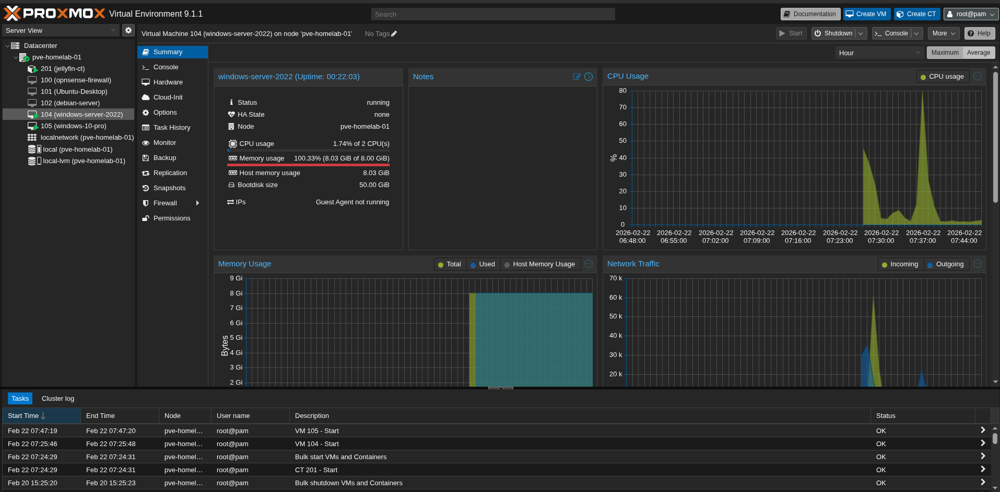
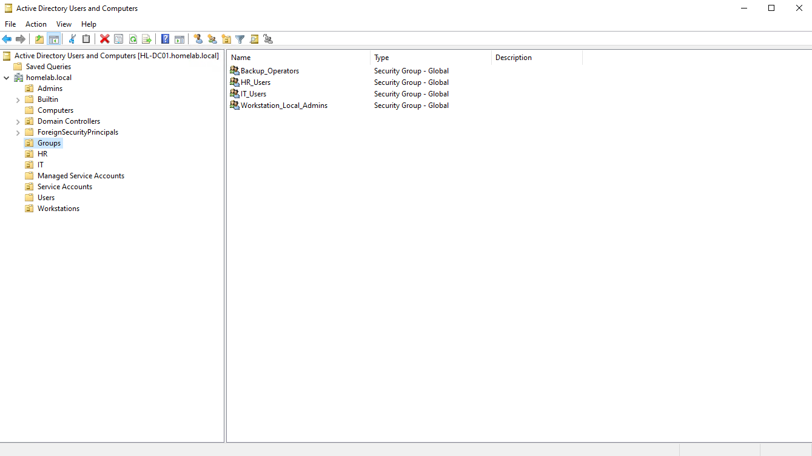
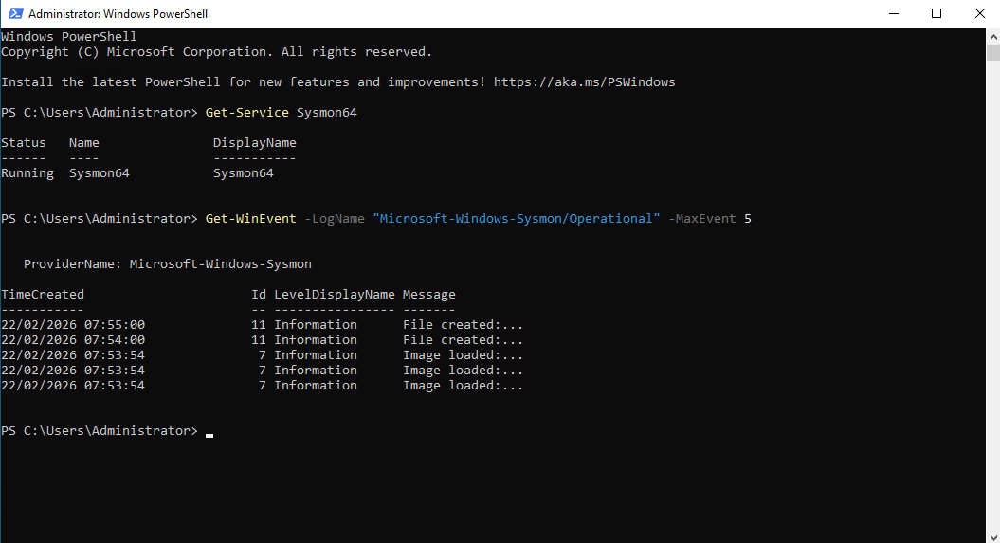
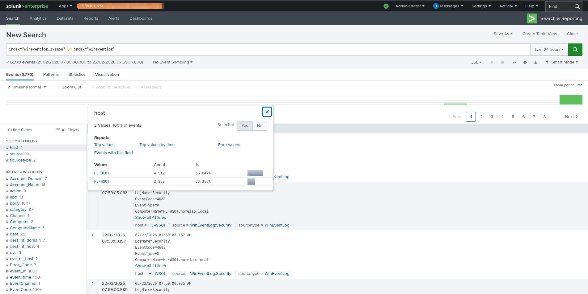

# Lab Setup Guide

> **Author:** Karishan  
> **Domain:** homelab.local  
> **Hypervisor:** Proxmox VE

---

## Network Topology



| Machine | IP | OS | Role |
|---------|----|----|------|
| HL-DC01 | 192.168.0.104 | Windows Server 2022 | Domain Controller |
| HL-WS01 | 192.168.0.105 | Windows 10 22H2 | Victim Workstation |
| Kali | 192.168.0.103 | Kali Linux | Attacker |
| Ubuntu | 192.168.0.135 | Ubuntu 24.04 | Splunk SIEM |

---

## Phase 1 — Active Directory Setup

### Install AD DS on DC01
```powershell
Install-WindowsFeature -Name AD-Domain-Services -IncludeManagementTools

Install-ADDSForest `
  -DomainName "homelab.local" `
  -DomainNetbiosName "HOMELAB" `
  -ForestMode "WinThreshold" `
  -DomainMode "WinThreshold" `
  -InstallDns:$true `
  -Force:$true
```

### Create OUs
```powershell
New-ADOrganizationalUnit -Name "Admins"           -Path "DC=homelab,DC=local"
New-ADOrganizationalUnit -Name "HR"               -Path "DC=homelab,DC=local"
New-ADOrganizationalUnit -Name "IT"               -Path "DC=homelab,DC=local"
New-ADOrganizationalUnit -Name "Service Accounts" -Path "DC=homelab,DC=local"
New-ADOrganizationalUnit -Name "Groups"           -Path "DC=homelab,DC=local"
New-ADOrganizationalUnit -Name "Workstations"     -Path "DC=homelab,DC=local"
```

### Create Users
```powershell
# Domain Admin
New-ADUser -Name "Domain Administrator" -SamAccountName "da_admin" `
  -AccountPassword (ConvertTo-SecureString "Password123!" -AsPlainText -Force) `
  -Path "OU=Admins,DC=homelab,DC=local" -Enabled $true

# Dave Brown — initial access target (HR User)
New-ADUser -Name "Dave Brown" -SamAccountName "brown" `
  -AccountPassword (ConvertTo-SecureString "password@123" -AsPlainText -Force) `
  -Path "OU=HR,DC=homelab,DC=local" -Enabled $true

# Alice Johnson — lateral movement pivot (IT User)
New-ADUser -Name "Alice Johnson" -SamAccountName "johnson" `
  -AccountPassword (ConvertTo-SecureString "password@123" -AsPlainText -Force) `
  -Path "OU=IT,DC=homelab,DC=local" -Enabled $true

# svc_backup — Kerberoast target
New-ADUser -Name "svc_backup" -SamAccountName "svc_backup" `
  -AccountPassword (ConvertTo-SecureString "Summer2024!" -AsPlainText -Force) `
  -Path "OU=Service Accounts,DC=homelab,DC=local" `
  -PasswordNeverExpires $true -Enabled $true
```

### Create Groups and Assign Members
```powershell
New-ADGroup -Name "HR_Users" -GroupScope Global -Path "OU=Groups,DC=homelab,DC=local"
New-ADGroup -Name "IT_Users" -GroupScope Global -Path "OU=Groups,DC=homelab,DC=local"
New-ADGroup -Name "Workstation_Local_Admins" -GroupScope Global -Path "OU=Groups,DC=homelab,DC=local"

Add-ADGroupMember -Identity "HR_Users"                 -Members "brown"
Add-ADGroupMember -Identity "IT_Users"                 -Members "johnson"
Add-ADGroupMember -Identity "Workstation_Local_Admins" -Members "johnson","svc_backup"
Add-ADGroupMember -Identity "Domain Admins"            -Members "da_admin"
Add-ADGroupMember -Identity "Backup Operators"         -Members "svc_backup"
Add-ADGroupMember -Identity "Remote Management Users"  -Members "svc_backup"

# Set SPN on svc_backup — makes it Kerberoastable
Set-ADUser -Identity "svc_backup" `
  -ServicePrincipalNames @{Add="HTTP/backup.homelab.local"}
```



---

## Phase 1 — File Shares
```powershell
New-Item -Path "C:\Shares\HR_Share" -ItemType Directory
New-Item -Path "C:\Shares\IT_Share" -ItemType Directory

New-SmbShare -Name "HR_Share" -Path "C:\Shares\HR_Share" `
  -FullAccess "HOMELAB\da_admin" `
  -ChangeAccess "HOMELAB\HR_Users" `
  -ReadAccess "HOMELAB\IT_Users"

New-SmbShare -Name "IT_Share" -Path "C:\Shares\IT_Share" `
  -FullAccess "HOMELAB\da_admin" `
  -ChangeAccess "HOMELAB\IT_Users" `

# Create sensitive files
"Employee salary data - CONFIDENTIAL" | Out-File "C:\Shares\HR_Share\fake_payroll.xlsx"
"HR Passwords 2024 - Internal Use Only"  | Out-File "C:\Shares\HR_Share\passwords.txt"
"Server Configuration notes"          | Out-File "C:\Shares\IT_Share\server_config.docx"
"Backup Configuration"  | Out-File 
"C:\Shares\IT_Share\backup_config.ps1"
```

---

## Phase 1 — Audit Policies

Run on **both DC01 and HL-WS01:**
```powershell
auditpol /set /subcategory:"Logon"                              /success:enable /failure:enable
auditpol /set /subcategory:"Credential Validation"              /success:enable /failure:enable
auditpol /set /subcategory:"Kerberos Authentication Service"    /success:enable /failure:enable
auditpol /set /subcategory:"Kerberos Service Ticket Operations" /success:enable /failure:enable
auditpol /set /subcategory:"Process Creation"                   /success:enable
auditpol /set /subcategory:"Special Logon"                      /success:enable
auditpol /set /subcategory:"Sensitive Privilege Use"            /success:enable /failure:enable
auditpol /set /subcategory:"File Share"                         /success:enable /failure:enable
auditpol /set /subcategory:"Detailed File Share"                /success:enable /failure:enable
```

---

## Phase 1 — Sysmon Installation

Run on **both DC01 and HL-WS01:**
```powershell
# Download Sysmon
Invoke-WebRequest `
  -Uri "https://download.sysinternals.com/files/Sysmon.zip" `
  -OutFile "C:\Sysmon.zip"
Expand-Archive -Path "C:\Sysmon.zip" -DestinationPath "C:\Sysmon"

# Download SwiftOnSecurity config
Invoke-WebRequest `
  -Uri "https://raw.githubusercontent.com/SwiftOnSecurity/sysmon-config/master/sysmonconfig-export.xml" `
  -OutFile "C:\Sysmon\sysmonconfig.xml"

# Install
cd C:\Sysmon
.\Sysmon64.exe -accepteula -i sysmonconfig.xml

# Verify
Get-Service Sysmon64
Get-WinEvent -LogName "Microsoft-Windows-Sysmon/Operational" -MaxEvents 5
```



---

## Phase 1 — Splunk Setup

### Splunk Universal Forwarder — inputs.conf

Location: `C:\Program Files\SplunkUniversalForwarder\etc\system\local\inputs.conf`
```ini
[WinEventLog://Security]
disabled = false
index = wineventlog
renderXml = false
evt_resolve_ad_obj = true

[WinEventLog://System]
disabled = false
index = wineventlog
renderXml = false

[WinEventLog://Application]
disabled = false
index = wineventlog
renderXml = false

[WinEventLog://Microsoft-Windows-Sysmon/Operational]
disabled = false
index = wineventlog_sysmon
renderXml = true
source = XmlWinEventLog:Microsoft-Windows-Sysmon/Operational

[WinEventLog://Microsoft-Windows-PowerShell/Operational]
disabled = false
index = wineventlog
renderXml = false

[WinEventLog://Microsoft-Windows-WinRM/Operational]
disabled = false
index = wineventlog
renderXml = false
```

### Splunk Add-ons Required

- [Splunk Add-on for Sysmon](https://splunkbase.splunk.com/app/5709)
- [Splunk Add-on for Microsoft Windows](https://splunkbase.splunk.com/app/742)

### Splunk Indexes Created
```
wineventlog        — Windows Security, System, Application events
wineventlog_sysmon — Sysmon events
```


