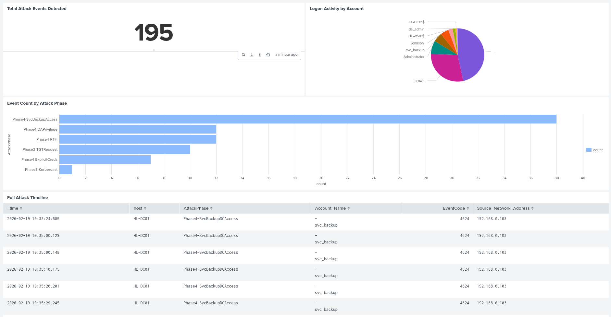
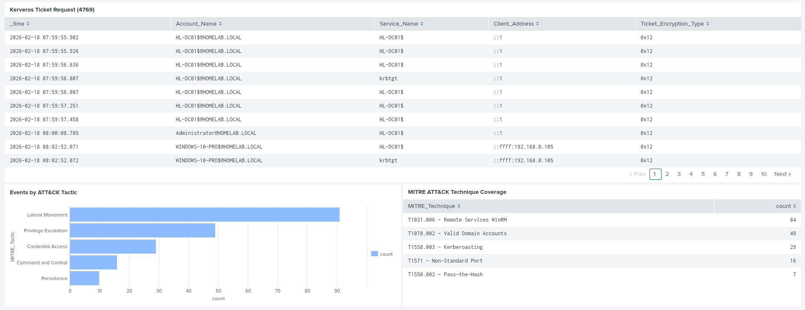

# APT Lateral Movement Investigation Report

> **Author:** Karishan  
> **Date:** February 2026  
> **Classification:** Confidential — Lab Exercise  
> **Domain:** homelab.local  
> **Duration:** 4 Days  
> **Status:** Complete

---

## Executive Summary

A simulated Advanced Persistent Threat (APT) attack was conducted against
the homelab.local Active Directory environment over a period of 4 days.
The simulation covered the full attack lifecycle from initial foothold
through to domain compromise, persistence, and data exfiltration.

Starting with a low-privileged HR user account (brown) with no
administrative rights, the attacker was able to escalate privileges to
full Domain Admin through a chain of credential harvesting, lateral
movement, and Active Directory abuse techniques.

The engagement resulted in complete domain compromise with 195 attack
events detected across 5 MITRE ATT&CK tactics using Splunk SIEM with
Sysmon telemetry.



---

## Engagement Scope

| Item | Detail |
|------|--------|
| Domain | homelab.local |
| Domain Controller | HL-DC01 (192.168.0.104) |
| Victim Workstation | HL-WS01 (192.168.0.105) |
| Attacker Machine | Kali Linux (192.168.0.103) |
| SIEM | Splunk (192.168.0.135) |
| Initial Access Account | brown (HR_Users — no admin rights) |
| Final Access Level | Domain Admin + Golden Ticket persistence |
| Total Attack Events | 195 confirmed events in Splunk |

---

## Attack Timeline

| Date | Phase | Action | Result |
|------|-------|--------|--------|
| Day 1 | Phase 2 | Meterpreter payload delivered to brown (HR) | Reverse shell on HL-WS01 |
| Day 1 | Phase 3 | Kerberoasting svc_backup | Password cracked — Summer2024! |
| Day 2 | Phase 3 | Secretsdump via johnson (IT) | SAM + cached hashes extracted |
| Day 2 | Phase 4 | svc_backup → Backup Operators abuse | NTDS.dit extracted from DC01 |
| Day 3 | Phase 4 | Pass-the-Hash as da_admin | Full Domain Admin access |
| Day 3 | Phase 5 | Golden Ticket forged with krbtgt hash | Permanent domain persistence |
| Day 4 | Phase 6 | HR + IT shares accessed and exfiltrated | 4 sensitive files stolen |
| Day 4 | Phase 7 | Splunk detection rules built and verified | 195 attack events confirmed |

---

## Technical Findings

### Finding 1 — Weak Service Account Password (Critical)

**Account:** svc_backup  
**Issue:** Service account with SPN had a weak password crackable
in minutes using a common wordlist  
**Impact:** Allowed Kerberoasting attack leading to plaintext credential recovery  
**Evidence:**
```bash
hashcat -m 13100 svc_backup_tgs.txt rockyou.txt
# Result: Summer2024! — cracked in under 5 minutes
```
**Detection:** EID 4769 with Ticket_Encryption_Type=0x17 (RC4)  
**Remediation:**
- Set strong password (25+ characters) on all service accounts
- Use Group Managed Service Accounts (gMSA)
- Enforce AES encryption — disable RC4 for Kerberos

---

### Finding 2 — Backup Operators Abuse (Critical)

**Account:** svc_backup  
**Issue:** Membership in BUILTIN\Backup Operators grants ability to
read any file on the system including NTDS.dit  
**Impact:** Complete extraction of all domain credentials  
**Evidence:**
```powershell
whoami /groups | findstr /i "backup"
# BUILTIN\Backup Operators  S-1-5-32-551
diskshadow /s shadow.txt
robocopy Z:\Windows\NTDS C:\bk ntds.dit /b
```
**Detection:** Sysmon EID 1 — diskshadow.exe execution on DC  
**Remediation:**
- Audit and minimise Backup Operators membership
- Monitor shadow copy creation on Domain Controllers
- Alert immediately on diskshadow execution on any DC

---

### Finding 3 — Pass-the-Hash (Critical)

**Account:** da_admin  
**Issue:** NTLM hash extracted from NTDS.dit used to authenticate
without knowing plaintext password  
**Impact:** Full Domain Admin access from attacker machine  
**Evidence:**
```bash
evil-winrm -i 192.168.0.104 -u da_admin -H 16cc85y6127b848l8t22c0ed37c037ab
```
**Detection:** EID 4624 LogonType=3 from Kali IP 192.168.0.103  
**Remediation:**
- Enable Protected Users security group for privileged accounts
- Deploy Credential Guard on all workstations
- Disable NTLM where Kerberos is available

---

### Finding 4 — Golden Ticket Persistence (Critical)

**Account:** Administrator (forged)  
**Issue:** krbtgt hash extracted from NTDS.dit used to forge
permanent Kerberos tickets valid for 10 years  
**Impact:** Persistent domain access surviving all password resets  
**Evidence:**
```bash
impacket-ticketer -nthash <krbtgt_hash> \
  -domain-sid S-1-5-21-2195649446-2062443387-493594790 \
  -domain homelab.local Administrator
crackmapexec smb HL-DC01.homelab.local --use-kcache -u Administrator
# Result: Pwn3d!
```
**Detection:** EID 4768 anomalous TGT requests from Kali IP  
**Remediation:**
- Reset krbtgt password TWICE with replication delay between resets
- Monitor for Kerberos tickets with abnormal lifetimes
- Deploy Microsoft Defender for Identity (MDI)

---

### Finding 5 — Weak User Passwords (High)

**Accounts:** brown (HR), johnson (IT)  
**Issue:** Both accounts used password@123 — easily guessable  
**Impact:** Enabled initial access and lateral movement  
**Evidence:** Credentials verified via CrackMapExec and Evil-WinRM  
**Remediation:**
- Enforce minimum 14 character password policy
- Implement banned password list
- Enable MFA for all domain accounts

---

### Finding 6 — Excessive Service Account Privileges (High)

**Account:** svc_backup  
**Issue:** Service account member of both Workstation_Local_Admins
and Backup Operators — far more privilege than needed for backup tasks  
**Impact:** Enabled lateral movement to workstations and DC compromise  
**Remediation:**
- Apply principle of least privilege
- Remove svc_backup from Workstation_Local_Admins
- Use dedicated backup solution with minimal required permissions

---

## MITRE ATT&CK Coverage

| Technique | ID | Events | Confidence |
|-----------|-----|--------|------------|
| Remote Services WinRM | T1021.006 | 84 | High |
| Valid Domain Accounts | T1078.002 | 49 | High |
| Kerberoasting | T1558.003 | 29 | High |
| Non-Standard Port | T1571 | 16 | High |
| Pass-the-Hash | T1550.002 | 7 | High |
| User Execution | T1204 | ✅ | Medium |
| NTDS Dump | T1003.003 | ✅ | High |
| LSASS Memory | T1003.001 | ✅ | Medium |
| Golden Ticket | T1558.001 | ✅ | Medium |



---

## Detection Summary

| Phase | Detection | EventID | Fired |
|-------|-----------|---------|-------|
| 2 | Payload execution | Sysmon EID 1 | ✅ |
| 2 | Reverse shell | Sysmon EID 3 | ✅ |
| 3 | Kerberoasting RC4 | EID 4769 | ✅ |
| 3 | LSASS access | Sysmon EID 10 | ⚠️ Partial |
| 4 | svc_backup DC logon | EID 4624 | ✅ |
| 4 | Diskshadow execution | Sysmon EID 1 | ✅ |
| 4 | PTH logon | EID 4624 Type 3 | ✅ |
| 4 | DA privileges | EID 4672 | ✅ |
| 5 | Golden Ticket TGT | EID 4768 | ✅ |
| 6 | Data staging | EID 11 | ✅ |

---

## Detection Gaps

| Gap | Reason | Remediation |
|-----|--------|-------------|
| LSASS access partial | Secretsdump ran before Sysmon fully configured | Re-run with Sysmon active |
| WinRM inbound C2 | WinRM/Operational not in inputs.conf | Add to Splunk forwarder config |
| File deletion events | Sysmon EID 23 not enabled | Update Sysmon config |
| Network share access | EID 5140 audit policy gap | Enable Detailed File Share auditing |

---

## Splunk Alert Rules Configured

| Alert | Severity | Type | Trigger |
|-------|----------|------|---------|
| Kerberoasting Detected | High | Scheduled hourly | Results > 0 |
| LSASS Memory Access | Critical | Real Time | Per Result |
| NTDS Dump Attempt | Critical | Real Time | Per Result |
| Pass-the-Hash Pattern | High | Scheduled 15 min | Results > 0 |

---

## Remediation Priority Matrix

| Priority | Finding | Effort | Impact |
|----------|---------|--------|--------|
| P1 — Immediate | Reset krbtgt password twice | Low | Critical |
| P1 — Immediate | Reset all compromised passwords | Low | Critical |
| P1 — Immediate | Remove svc_backup from Backup Operators | Low | Critical |
| P2 — Short Term | Enable Protected Users group | Low | High |
| P2 — Short Term | Deploy Credential Guard | Medium | High |
| P2 — Short Term | Enforce AES-only Kerberos | Medium | High |
| P2 — Short Term | Implement gMSA for service accounts | Medium | High |
| P3 — Long Term | Deploy Microsoft Defender for Identity | High | Critical |
| P3 — Long Term | Implement tiered admin model | High | Critical |
| P3 — Long Term | Regular AD security assessments | Medium | High |

---

## Tools Used

| Tool | Version | Purpose |
|------|---------|---------|
| Metasploit | 6.x | Payload generation + handler |
| msfvenom | 6.x | Stageless payload creation |
| Impacket | 0.14.0 | GetUserSPNs, secretsdump, ticketer |
| Hashcat | 6.x | Offline hash cracking |
| Evil-WinRM | 3.9 | WinRM shell via hash |
| CrackMapExec | 5.x | SMB enumeration + auth testing |
| Sysmon | 15.x | Windows telemetry |
| Splunk | 9.x | SIEM + detection |

---

## Conclusion

The homelab.local environment was fully compromised through a realistic
APT attack chain exploiting several common Active Directory misconfigurations.
The attack demonstrated how a low-privileged user account combined with
weak service account passwords and excessive privileges can lead to complete
domain compromise.

Key takeaways from this engagement:

**For defenders:**
- Kerberoasting is easily detected via EID 4769 + RC4 encryption type
- diskshadow on a Domain Controller should always trigger an immediate alert
- Pass-the-Hash is detectable through logon type correlation and source IP analysis
- Golden Ticket detection requires anomaly-based monitoring and MDI deployment

**For the organisation:**
- Implement principle of least privilege across all service accounts
- Deploy tiered administration model to limit lateral movement
- Enable Credential Guard and Protected Users group immediately
- Regular purple team exercises to validate detection capability

> This lab demonstrates end-to-end attack simulation and detection
> capability covering initial access through persistence and exfiltration
> with full SIEM visibility mapped to MITRE ATT&CK framework.

---

## References

- [MITRE ATT&CK Framework](https://attack.mitre.org)
- [Impacket Suite](https://github.com/fortra/impacket)
- [SwiftOnSecurity Sysmon Config](https://github.com/SwiftOnSecurity/sysmon-config)
- [Splunk Add-on for Sysmon](https://splunkbase.splunk.com/app/5709)
- [Splunk Add-on for Microsoft Windows](https://splunkbase.splunk.com/app/742)
- [Microsoft — Backup Operators Abuse](https://docs.microsoft.com/en-us/windows-server/identity/ad-ds/plan/security-best-practices/appendix-d--securing-built-in-administrator-accounts-in-active-directory)
- [SpecterOps — Golden Ticket](https://posts.specterops.io/kerberosity-killed-the-domain-an-offensive-kerberos-overview-eb04b1402c61)
